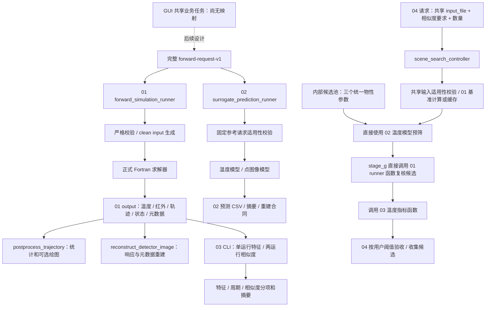

# P3.0 模块输入输出审计报告

审计编号：P3_AUDIT。日期：2026-09-12。

本阶段只新增本文档。采用静态源码、接口、说明文档交叉审计；没有执行 Python、Fortran、模型推理、后端程序或构建，没有生成请求文件。文中字段关系是审计结论，不表示 GUI 已实现映射或调用。

## 1. 结论与范围

1. 软件有四个正式后端入口，GUI 的五个功能入口不等于五份独立后端请求合同。“轨迹生成”目前是 **01 求解器输出轨迹 + 独立轨迹后处理脚本**，没有查到第五个独立轨迹计算请求入口。
2. 01 接收完整 `forward-request-v1`；02 的正式入口也接收这份完整请求，但只支持固定场景下三个统一物性参数的变化。三个模型输入参数不构成另一份正式用户输入合同。
3. 03 正式 CLI 接收 **01 的正式 output 目录**，提取温度和红外特征后评价；不能直接将 GUI 参数、02 温度 CSV 或点图像预测目录传给它。
4. 04 接收共享完整输入文件、温度相似度要求和候选数量。真实链路为：01 基准（可缓存）→02 温度模型预筛→01 候选复核→03 温度指标函数→按要求保留候选。当前默认验收链不包含点图像预测。
5. GUI `SimilarityIndex` 的业务归属是 **04 的候选验收要求**，未来对应 `similarity_requirement.required_percent`，不是 01 字段，也不是 03 CLI 的输入阈值。当前 GUI 默认 90%，04 示例默认 95%，是两个不同来源的默认值。
6. GUI `TargetType`、`ShellThickness`、自动质量都没有直接输入字段。冻结求解器只有固定 **5 mm 球壳**；GUI 可编辑壳厚不能原样送入当前后端，也不能静默丢弃后宣称质量一致。

本报告中的 01/02/03/04 仅用于维护追踪；不建议将编号或后端分区名显示为 GUI 一级页面。

## 2. 读取的依据文件与证据索引

已读取并遵守 `.docs/00_project_brief.md`、`01_architecture.md`、`02_workflow.md`、`04_decisions.md`、`05_known_issues.md`、`06_prompt_log.md`、`07_task_editor_v1_report.md`。同时读取现有 P2/P2.1 报告和当前 WPF 模型、页面绑定、共享编辑 ViewModel。维护文档的一般编译、日志更新流程服从本次“只新增审计报告”的范围限制。

以下路径相对仓库根目录。表内证据编号可用于后文追溯；源码函数名比行号更适合后续维护定位。

|编号|实际依据文件|审计用途|
|---|---|---|
|D0|`coreprogram/00-软件程序说明.docx`|四模块总体用途和原有调用描述；读取正文及表格文本|
|D1|`coreprogram/01-正向仿真/00-正向仿真模块统一说明.docx`|正式六分区、物理单位、固定球壳、业务输出说明；实际文件前缀为 00|
|D2|`coreprogram/00-软件参数接口表.xlsx`|读取六个工作表，核对分区字段、单位及业务/内部边界；这是当前实际接口表文件名|
|C0|`coreprogram/config.json`；`coreprogram/00-运行环境与部署说明.txt`|包根目录相对资源路径、正式入口、运行说明|
|C1|`coreprogram/01-正向仿真/01-输入文件/forward_request_schema.json`、`forward_request_example.json`、`clean_case_template.dat`|01 合同、完整示例与序列化模板|
|F1|`coreprogram/01-正向仿真/02-程序/forward_simulation_runner.py`|`validate_request`、`to_generator_config`、`run_forward_simulation`、`parse_forward_outputs`、CLI|
|F2|同目录 `generate_clean_formal_case.py`、`production_main_output_interface.f90`|字段消费、固定壳厚和质量、运动更新、输出写入|
|F3|同目录 `production_numerical_config.json`、`production_numerical_config.inc`、`production_output_policy.inc`|内部数值参数与输出开关，不属于业务请求|
|T1|同目录 `postprocess_trajectory.py`、`run_trajectory_postprocess.bat`|轨迹 CSV 输入、过滤规则、统计与可选绘图|
|I1|同目录 `reconstruct_detector_image.py`|01 响应+元数据重建像面数据的独立工具|
|S1|`coreprogram/02-智能预测/02-程序/surrogate_prediction_runner.py`、`surrogate_standard_input.py`、`入口程序使用说明.txt`|完整输入、适用性限制、温度/点图像模式与输出|
|S2|同目录 `stage_f_run_point_image_candidate_evaluation_v1.py`、`stage_utils.py`|点图像特征合同、模型及模板资源定位|
|S3|`coreprogram/02-智能预测/03-模型文件/surrogate_reference_request.json`、`scalers.json`、`point_image_fixed_scene_runtime.csv`（表头和样本）|固定请求逐字段对比、5 个全局/14 个局部特征、模型输出列；未反序列化模型二进制|
|E1|`coreprogram/03-相似度评估/02-程序/similarity_evaluator.py`、`入口程序使用说明.txt`|正式 features/similarity 入口、目录要求、输出|
|E2|同目录 `response_feature_extractor.py`、`periodic_feature_analyzer.py`、`similarity_metrics.py`|强制输入列、特征算法、有效性、评价公式与配置消费|
|E3|`coreprogram/03-相似度评估/01-输入文件/similarity_config.json`|正式评价配置与当前默认值|
|R1|`coreprogram/04-红外场景构建/02-程序/scene_search_controller.py`、`stage_g_run_source_case_forward_recheck_v1.py`、`stage_utils.py`、`入口程序使用说明.txt`|共享输入校验、缓存、预筛、候选复核、验收、输出|
|R2|`coreprogram/04-红外场景构建/01-输入文件/scene_search_request.json`、`scene_search_config.json`、`04_global_parameter_pool_10000.csv`|业务请求与内部配置分离、候选列合同|
|G1|`GUI_WPF/PreProcess.Wpf/PreProcess.Wpf/Models/TaskModel.cs`、`TargetGeometrySettings.cs`、`TargetPhysics.cs`、`SceneMotionSettings.cs`、`EnvironmentObservationSettings.cs`、`CalculationSettings.cs`|当前真实 GUI 数据所有者、默认值、覆盖机制|
|G2|同工程 `Views/` 五个业务页面及 `TargetPhysicsEditor.xaml`；`ViewModels/TaskEditorViewModel.cs`|页面名称、绑定、共享内存模型、按钮现状|

说明文档优先用于解释业务；遇到描述差异，使用当前入口和最终消费者的实际代码判定，并在第 9 节明确记录。没有根据旧设计图补入参数。

## 3. 真实总体调用关系

图中的 04→02 和 04→03 是**模型/函数复用**：04 并不通过 `surrogate_prediction_runner.py` 或 `similarity_evaluator.py` 的 CLI 串联文件。04 动态加载 03 入口导出的 `evaluate_temperature_curves`；最终实现位于 `similarity_metrics.py`。03 CLI 的完整红外/周期评价与 04 的温度专用评价不能混称为同一条流程。

不存在已确认的“02 预测输出目录→03 正式 CLI”直接连接。02 CSV 缺少 03 强制要求的正式温度列和完整红外响应列；未来若需要评价代理结果，必须另行确认适配方案，不能只改路径。

## 4. 模块输入输出表

### 4.1 正向计算：全部正式业务输入

入口：`forward_simulation_runner.py --params-json <完整请求文件>`。文件可以名为 request.json，但入口不要求固定文件名。以下入口字段来自 C1/F1，单位和用途交叉核对 D1/D2/F2。

表中的“是”指有业务编辑意义且合同存在该字段，不表示 GUI 已经序列化；“是/高级”指当前适宜放在高级区域。三分量字段不拆为三行。01 业务字段都必须显式提供，无业务默认值回退。

|参数/数据|来源|目标模块|入口字段|是否GUI输入|备注|
|---|---|---|---|---|---|
|仿真时长|任务设置|01；02/04 有固定限制|`CASE.TOTAL_TIME`|是|s，有限且 >0；02/04 固定 1000 s|
|目标数量|任务设置|01；02/04 有固定限制|`CASE.NUM_SPHERES`|是|整数 ≥1；02/04 固定 16；GUI 10000 上限是内存保护而非后端合同上限|
|太阳辐照度|环境|01；02/04 只允许参考值|`ENVIRONMENT.SOLAR_FLUX`|是|W/m²，太阳外部辐射输入|
|太阳方向|环境|同上|`ENVIRONMENT.SOLAR_DIRECTION`|是|三分量方向，无量纲|
|环境辐射温度|环境|同上|`ENVIRONMENT.ENVIRONMENT_TEMP`|是|K，辐射背景温度，不是流体温度|
|群初始位置|场景|01；02/04 只允许参考值|`GROUP_STATE.GROUP_CENTER`|是|m，群中心初始位置|
|群方向|场景|同上|`GROUP_STATE.GROUP_NORMAL`|是|三分量方向，无量纲|
|群参考上方向|场景|同上|`GROUP_STATE.GROUP_UP`|是|三分量方向，无量纲|
|群速度|场景|同上|`GROUP_STATE.GROUP_VELOCITY`|是|m/s，群中心运动初值|
|群角速度|场景|同上|`GROUP_STATE.GROUP_ANGULAR_VELOCITY`|是/高级|rad/s|
|群角加速度|场景|同上|`GROUP_STATE.GROUP_ANGULAR_ACCELERATION`|是/高级|rad/s²|
|观测孔径位置|观测|01；02/04 只允许参考值|`OBSERVATION.APERTURE_CENTER`|是|m；不是额外的探测器中心输入|
|孔径方向|观测|同上|`OBSERVATION.APERTURE_NORMAL`|是|无量纲方向|
|孔径参考上方向|观测|同上|`OBSERVATION.APERTURE_UP`|是|无量纲方向|
|孔径速度|观测|同上|`OBSERVATION.APERTURE_VELOCITY`|是/高级|m/s|
|孔径角速度|观测|同上|`OBSERVATION.APERTURE_ANGULAR_VELOCITY`|是/高级|rad/s|
|孔径角加速度|观测|同上|`OBSERVATION.APERTURE_ANGULAR_ACCELERATION`|是/高级|rad/s²|
|孔径跟踪群中心|观测|同上|`OBSERVATION.APERTURE_TRACK_TARGET`|是|JSON 布尔值；不接受目标编号|
|孔径尺寸|观测|同上|`OBSERVATION.APERTURE_SIZE`|是|m|
|探测器方向|观测|同上|`OBSERVATION.DETECTOR_NORMAL`|是/高级|无量纲方向|
|探测器参考上方向|观测|同上|`OBSERVATION.DETECTOR_UP`|是/高级|无量纲方向|
|探测器速度|观测|同上|`OBSERVATION.DETECTOR_VELOCITY`|是/高级|m/s；跟踪模式下最终运动受孔径跟随逻辑约束|
|探测器角速度|观测|同上|`OBSERVATION.DETECTOR_ANGULAR_VELOCITY`|是/高级|rad/s|
|探测器角加速度|观测|同上|`OBSERVATION.DETECTOR_ANGULAR_ACCELERATION`|是/高级|rad/s²|
|探测器跟踪群中心|观测|同上|`OBSERVATION.DETECTOR_TRACK_TARGET`|是|布尔值；F2 `update_motion_state` 指向群中心，跟踪时探测器速度跟随孔径|
|像面尺寸|观测|同上|`OBSERVATION.SPOT_PLANE_SIZE`|是|m；01 可输入，02 固定参考值；03 的评价像面配置需另外保持一致|
|焦距|观测|同上|`OBSERVATION.SPOT_FOCAL_LENGTH`|是|m|
|目标编号|目标集合|01；02/04 固定编号集合|`TARGET_PHYSICS[].id`|选择，编号由集合维护|完整唯一覆盖 1..N，与场景表 ID 一致|
|外半径|目标结构|01；02/04 固定参考值|`TARGET_PHYSICS[].r`|是|m，必须 >0.005；不是直径|
|材料密度|材料|同上|`TARGET_PHYSICS[].rho`|是|kg/m³，>0；用于内部球壳质量|
|比热|热物性|同上|`TARGET_PHYSICS[].cp`|是|J/(kg·K)，>0|
|红外发射率|物性|01/02/04|`TARGET_PHYSICS[].eps_ir`|是|无量纲；02/04 可变候选参数之一|
|太阳吸收率|物性|01/02/04|`TARGET_PHYSICS[].alpha_s`|是|无量纲；02/04 可变候选参数之一|
|红外反射率|物性|01；02/04 有关联限制|`TARGET_PHYSICS[].rho_ir`|是/高级|01 显式独立输入；02 要求等于 1−eps_ir；04 生成候选时如此赋值|
|内部热源功率|热源|01/02/04|`TARGET_PHYSICS[].q_int`|是|W，每个目标功率；02/04 可变候选参数之一，不是功率密度|
|初始温度|热物性|01；02/04 固定参考值|`TARGET_PHYSICS[].t_init`|是|K，>0；02 固定 300 K|
|目标编号|目标集合|01；02/04 固定集合|`TARGET_SCENE[].id`|选择，编号由集合维护|完整唯一覆盖 1..N|
|单目标初始相对位置|单目标运动|01；02/04 固定参考场景|`TARGET_SCENE[].x,y,z`|是/高级|m，相对群中心的初始偏移；不能当作绝对位置传入|
|释放分离速度|单目标运动|同上|`TARGET_SCENE[].vx,vy,vz`|是/高级|m/s，释放后的相对分离运动；不等于最终世界速度|
|释放分离加速度|单目标运动|同上|`TARGET_SCENE[].ax,ay,az`|是/高级|m/s²，配合释放后经过时间计算|
|释放时间|单目标运动|同上|`TARGET_SCENE[].release_time`|是/高级|s，≥0；1 号目标必须为 0（入口数值容差 1e-12）|
|启用状态|单目标运动|同上|`TARGET_SCENE[].active`|是/高级|JSON 布尔值；1 号必须 true；不是用户输入 released_flag|

F1 对方向首先检查有限三分量；这不等于任意零向量或退化朝向都可用于物理计算。F2 还处理归一化、坐标系和几何有效性。入口对多项光学系数只检查有限值，不能把 02 的训练范围误称为所有 01 输入范围。

F2 `read_clean_sphere_tables` 将初始偏移加到群中心；`update_member_motion_state` 使用释放后经过时间计算相对位移，再施加群角运动，并把群速度、角运动速度和分离速度组成世界速度。后续设计必须保留这些语义，不能把 GUI 三组运动量机械拼接为绝对轨迹。

### 4.2 正向计算：内部固定项与输出

|参数/数据|来源|目标模块|入口字段|是否GUI输入|备注|
|---|---|---|---|---|---|
|球壳类型、壁厚|F2 编译常量|01|无；`TARGET_SHELL_THICKNESS=0.005d0`|否|唯一已实现结构；不能给 request 增加类型/厚度|
|质量、热容|F2 `initialize_sphere_properties`|01 内部|无|否，GUI可显示派生值|`m=ρ·4π/3·(R³−(R−0.005)³)`；热容 m·cp；辐射面积仍为外球面积|
|热时间步、轨道积分步|F3|01 内部|无|否|`TIME_STEP=1`、`ORBIT_INTEGRATOR_DT=1` s|
|采样与数值控制|F3|01 内部|无|否|两种光线数均 200000，反射上限 10，混合系数 0.1，种子 537|
|输出采样、网格、光斑半径|F3|01 内部|无|否|帧间隔 10，256×256，半径单元数 0；不得添入业务请求|
|输出开关|F3 output policy|01 内部|无|否|业务核心与帧摘要启用；derived/QA/debug 输出关闭。数值配置里有旧输出选项不代表当前 policy 会写出全部文件|
|运行根目录、超时、准备模式|调用者运行选项|01 CLI|`--run-root`、`--timeout-seconds`、`--prepare-only`|未来运行设置|默认超时 1800 s；不在请求分区内；prepare-only 仍会启动输入生成脚本，本次未运行|
|正式温度|01 求解器|GUI结果/03/04|`output/temperature_history.csv`|否，输出|`frame,time_s,T_1…T_N`，温度 K|
|正式红外响应|01 求解器|GUI结果/03/像面重建|`output/infrared_response_history.csv`|否，输出|含 case_id、frame_id、time_s、object_id、active_flag、released_flag、radiation_power_W、radiant_intensity_W_sr、detector_received_power_W、detector_irradiance_W_m2、screen_x_m、screen_y_m、in_screen_flag、range_to_detector_m|
|正式轨迹|01 求解器|轨迹后处理/GUI结果|`output/trajectory_history.csv`|否，输出|逐帧逐目标，详见第 6 节|
|状态|01 求解器|01 runner/后续运行层|`output/solver_status.txt`|否，输出|solver_status、result_valid、message；成功需状态与进程返回共同满足|
|帧摘要、元数据|01 求解器|结果说明/像面重建|`output/frame_summary.csv`、`output/run_metadata.json`|否，输出|元数据描述网格、像面、重建约束等；不能只凭文件名假定有效|
|请求与运行记录|01 runner|溯源|`request.json`、`case_config.json`、`input.dat`、`result.json`、`stdout.txt`、`stderr.txt`|否，运行产物|位于本轮 run；不是 GUI 新的业务输入字段|
|兼容温度文件|01 runner|旧流程兼容|`sphere1_temperature.csv`|否，兼容产物|1000 s 场景才尝试生成 0:10:1000 的兼容曲线，不能替代一般时长正式输出|

01 默认目录为 `01-正向仿真/03-输出文件/runs/run_*/output/`。F1 的输出有效性检查强制温度、红外、状态文件，红外最低必需列比 03 少；它没有把轨迹、元数据、帧摘要都作为成功的强制前提。因此“01 runner 成功”不充分保证后续 03/轨迹工具可用。异常早退、超时也不保证生成完整 result.json；不应在未来运行层把缺少 result.json 当成唯一失败形式。

### 4.3 智能预测：实际输入特征与输出

入口：`surrogate_prediction_runner.py --params-json <完整请求> --mode temperature|point-image|both`，默认 both，另有 `--run-root`。S1 先借用 01 的请求验证函数，再与 S3 参考请求进行适用性比较，不会为预测调用 01 求解器。

|参数/数据|来源|目标模块|入口字段|是否GUI输入|备注|
|---|---|---|---|---|---|
|完整场景请求|与 01 共用合同|02 标准化层|`--params-json`；六个完整分区|有条件|时长、数量、环境、群状态、观测、单目标场景必须匹配冻结参考请求|
|统一内部热源|各目标 q_int|02 温度/点图像模型|模型 `q_int`|是，有条件|所有目标一致，范围 0…300 W|
|统一红外发射率|各目标 eps_ir|02 温度/点图像模型|模型 `emissivity_ir`|是，有条件|所有目标一致，范围 0.2…0.95|
|统一太阳吸收率|各目标 alpha_s|02 温度/点图像模型|模型 `absorptivity_solar`|是，有条件|所有目标一致，范围 0.2…0.95|
|红外反射率关联校验|各目标 rho_ir|02 适用性校验|`TARGET_PHYSICS[].rho_ir`|受约束|必须与 1−eps_ir 一致；不是第四个自由模型特征|
|固定物性|r、rho、cp、t_init、id|02 适用性校验|完整目标物性行|不可自由改变|相对于参考请求固定；改变将拒绝，不会被忽略|
|时间采样|内部序列|02 温度模型|`time_s`|否|0…1000 s，每 10 s，共 101 点|
|组合特征|前三项+时间|02 温度模型|`q_int_times_absorptivity_solar`、`q_int_div_emissivity_ir`、`is_initial_condition`|否，派生|连同前三项和 time_s 共 7 个特征；首点强制 300 K|
|距离与时间|固定模型侧 CSV|02 点图像模型|`distance_to_detector`、`time_s`|否，固定模板来源|连同三个物性构成 5 个全局特征；不是根据任意当前 GUI 运动重算|
|目标局部特征|固定模型侧 CSV|02 点图像模型|`sphere_id_norm, active_flag, sphere_init_x/y/z, sphere_vx/vy/vz, sphere_release_time, sphere_age_s, sphere_released_flag, sphere_pos_x/y/z`|否，固定模板来源|14 列；位置/速度/时间通常按 m、m/s、s，ID/状态无量纲；模型按 scalers 归一化|
|冻结模型和归一化信息|S3 模型资源|02 内部|joblib / Keras / scalers|否|本次只读配置和调用代码，未载入二进制模型验证推理|
|温度预测|02 温度模型|GUI结果/专用评价|`temperature_prediction.csv`|否，输出|`time_s,temperature_prediction_K`；当前是配置目标（1号）的曲线，不是 16 条目标温度|
|点图像预测|02 点图像模型|GUI结果/后续专用重建|`point_token_predictions.csv.gz`|否，输出|逐帧逐目标预测 screen_x、screen_y、log_spot_power、log_spot_intensity，经逆变换派生功率、强度、像素位置与界内标志|
|点图像帧指标|02 汇总|GUI结果|`point_image_frame_metrics.csv`|否，输出|释放/界内数量、总/峰值功率及强度、质心等；不是 PNG 文件合同|
|重建合同|02|后续绘制|`point_image_reconstruction_contract.json`|否，输出|256×256、单像素投影、同像素叠加，不加 PSF、插值或平滑|
|预测溯源|02|运行记录|`request.json`、`normalized_surrogate_input.json`、`prediction_summary.json`、`latest_run.json`|否，输出|默认 `02-智能预测/04-输出文件/runs/run_*/`；latest_run 位于输出根|

S1 数值参考比较采用容差，物性按 ID 整理；场景列表比较还依赖参考行顺序。GUI 的“单目标覆盖”即使可以供 01 使用，只要导致三个可变参数不统一或其他参考值改变，就不满足当前 02 适用范围。

## 5. 相似度评估与红外场景构建

### 5.1 03 正式入口和评价配置

|参数/数据|来源|目标模块|入口字段|是否GUI输入|备注|
|---|---|---|---|---|---|
|提取/比较模式|计算功能选择|03|`--mode`：features / similarity|未来计算设置|不是业务物性参数|
|单运行输入目录|01 正式 output|03 features|`--run-dir`|未来结果选择|必须直接包含正式 CSV，不会自动从 run 根追加 output|
|参考/候选目录|两份 01 正式 output|03 similarity|`--reference-run`、`--candidate-run`|未来结果选择|不是 GUI 参数对象、02 CSV 或 request.json|
|温度目标|E3 评价配置|03|`temperature.object_id`|可考虑高级评价设置|默认 1；不等于孔径/探测器跟踪开关|
|早期/平台时间窗|E3|03|`temperature.early_window_s`、`plateau_window_s`|可考虑高级评价设置|默认 [0,30]、[100,1000] s，窗口必须有样本|
|像面几何|E3|03 像素归并/位置尺度|`screen.nx,ny,width_m,height_m`|需关联结果依据|默认 256×256、0.0128×0.0128 m；当前不自动读取 run_metadata 来覆盖配置|
|灰度映射|E3|03|`gray_mapping.enabled,bit_depth,min_value,max_value`|未来高级配置，需先冻结物理范围|默认 enabled=true、8位、min=0、max=null；默认总灰度与相关周期项无效，不能展示为零分|
|周期信号与判定|E3|03|`periodic.signals,min_samples,uniform_time_rtol,min_std_relative,min_observed_cycles,min_spectral_concentration,max_frequency_Hz`|未来高级配置|默认 4 种信号、16点、1e-6、1e-8、2周期、0.2、无频率上限；线性去趋势+rFFT|
|数值有效性容差|E3|03|`similarity.amplitude_zero_tolerance,variance_tolerance`|内部/高级|配置默认均 1e-30；温度趋势函数另用自身默认方差容差 1e-14，不能认为全路径共用同一阈值|
|算法描述字段|E3|03 文档性配置|`temperature.reference_scale`、`screen.spot_radius_cells`、`gray_mapping.source,require_explicit_fixed_range`、`periodic.implementation_convention`、`similarity.aggregation,time_alignment`|不应直接开放为有效选项|当前消费代码未用这些键切换算法；参考温差、单像素叠加、固定灰度范围、最小有效分项、精确时间对齐由实现规定|
|评价文件与输出根|运行设置|03|`--config`、`--output-dir`|未来运行设置|output-dir 是根目录，内部仍建立唯一 run|
|特征输出|E2|GUI结果/03比较|`feature_timeseries.csv`、`object_feature_timeseries.csv`、`feature_summary.json`、`periodic_features.csv`|否|成对模式分别写 reference_features、candidate_features 子目录|
|相似度输出|E2|GUI结果|`similarity_components.csv`、`similarity_summary.json`|否|温度、红外、场景相似度，限制分项，有效/无效项数|
|评价记录|E1|运行溯源|`evaluation_request.json`、`similarity_config_used.json`、`evaluation_status.json`、`latest_run.json`|否|默认 `03-相似度评估/03-输出文件/runs/run_*/`；latest_run 在输出根|

E2 强制读取 temperature_history.csv 的 `time_s,T_<object_id>` 和第 4.2 节列出的完整红外列，特别要求 `radiant_intensity_W_sr`，不会从旧列悄悄推算。温度表按显式时间计算后向差分；场景统计仅纳入启用且已释放对象，接收功率/质心等进一步限制到像面内对象。像素功率叠加后由像素面积算辐照度，并使用同一固定灰度范围。

03 的温度误差包括 RMSE、MAE、最大绝对误差、末点误差、平台平均误差的绝对值、早期最大误差。水平相似度为 `100/(1+D/R_T)`，R_T 是参考温度最大值减最小值；温度变化率趋势相似度为 `50(1+Pearson相关系数)`。红外还评价幅值、变化趋势、像面位置、逐目标位置及有效周期特征。各块取有效分项最小值，场景取有效块最小值；无效项有原因，不能当作通过或零误差。时间轴要求精确匹配，没有隐藏插值。

### 5.2 04 业务请求、内部参数与最终验收

正式入口：`scene_search_controller.py --request <scene-search-request-v2文件> --config <内部配置>`。

|参数/数据|来源|目标模块|入口字段|是否GUI输入|备注|
|---|---|---|---|---|---|
|共享源任务文件|完整 forward-request-v1|04 请求|`input_file`|未来任务引用|相对路径按包根解析；先经 02 标准化层检查，因此 04 源任务也受固定代理场景限制|
|评价类型|当前正式合同|04|`similarity_requirement.metric`|目前固定|只接受 `temperature_similarity`，没有点图像/综合红外阈值选择|
|评价目标编号|当前正式合同|04|`similarity_requirement.target_object_id`|目前固定|只接受 1|
|要求的温度相似度|GUI SimilarityIndex 的业务用途|04 最终验收|`similarity_requirement.required_percent`|是，后续尚需设计|百分数值 90 表示 90%，不是 0.9；后端范围 (0,100]，GUI 范围 [50,100] 是更窄的产品限制|
|所需候选数量|用户要求|04|`required_candidate_count`|未来需要新增实际设置|正整数，示例 10；不是任务目标数量 N|
|候选参数池|内部 CSV|04|`candidate_pool_csv`；列 `candidate_id,q_int,emissivity_ir,absorptivity_solar`|内部配置|按文件顺序遍历，不是 GUI 的单目标列表，也不是在线生成空间轨迹|
|代理预筛六误差上限|内部模型精度配置|04|`surrogate_prescreen.thresholds_K`|内部固定配置|RMSE 12.193、MAE 10.157、最大32.248、末点12.247、平台12.246、早期32.062 K；不使用 SimilarityIndex 计算这些上限|
|模型校验与顺序策略|内部配置|04|`temperature_model_expected_sha256` 等|否|实际校验温度模型 hash；顺序由代码按输入行执行，说明文本不是排序算法选择器|
|基准曲线|同一源任务的01结果/缓存|04|参考 temperature_history.csv 的 T_1|否|101点；缓存按规范化输入和求解器 SHA 等检查；跨任务目录 reference_runs|
|代理候选曲线|直接调用02温度模型|04 预筛|7维温度特征→101点曲线|否|与01基准比较六个温度误差，全部达到内部精度限才进入候选正向复核|
|候选真实请求|源任务拷贝+候选池|01 复核|覆盖全部目标 `q_int,eps_ir,alpha_s,rho_ir`|否，内部派生|rho_ir=1−eps_ir，保留同一场景和其他参数；stage_g 调用01 runner函数，超时1800 s|
|候选真实相似度|01候选曲线+01基准曲线|03温度函数→04验收|`evaluate_temperature_curves` 的七个温度分项|否，计算结果|04 取有效温度分项最小值，达到用户 required_percent 才正式保留|
|候选与过程结果|04|GUI结果|`candidate_parameters.csv`、`candidate_temperature_curves.csv`、`scene_search_log.csv`|否|正式保留候选参数/曲线、逐候选筛选记录；旧 ten_valid_* 文件已停用|
|任务结果与溯源|04|运行管理|`scene_search_summary.json`、`scene_search_status.json`、`scene_search_request_used.json`、`source_forward_request_used.json`、`latest_run.json`|否|默认 `04-红外场景构建/03-输出文件/runs/run_*/`；候选01输出在该 run 的 forward_runs；共享基准缓存不在该 run 内|

04 的阈值使用顺序已由 R1 确认：用户要求控制**候选真实温度复核后的接收**，02 预筛只使用模型精度上限。报告中的 `D_allow=R_T·(100/S_required−1)` 是水平误差容许值说明；包含趋势项的正式验收仍以最低有效温度相似度为准，不能只比较最大误差替代。

正式运行在得到足量候选后停止，否则耗尽参数池；不足为 `Controlled incomplete`，不能解释为找到足量结果。`--max-candidates` 等是受控测试覆盖项。`--proxy-only` 仍需要先取得 01 基准，不是“绝不调用后端”的预测模式；其 ProxyOnlyCompleted 也不是正式候选验收成功。旧 `--skip-point-image`/`--require-point-image` 只保留解析兼容，没有恢复当前默认链中的点图像步骤。

## 6. 轨迹与点图像辅助入口

### 6.1 “轨迹生成”的实际能力

F2 在业务输出路径调用 `write_trajectory_history_row`（约第 5268 行），正式表头为：

`case_id,frame_id,time_s,object_id,active_flag,released_flag,motion_stage,release_time_s,x_m,y_m,z_m,vx_m_s,vy_m_s,vz_m_s,speed_m_s,range_to_detector_m`。

这些位置/速度是求解器输出的世界状态，不能混同第 4.1 节的初始相对偏移/分离速度。

|参数/数据|来源|目标模块|入口字段|是否GUI输入|备注|
|---|---|---|---|---|---|
|运动状态、释放、激活、观测位置等|GUI完整任务→01|01求解器轨迹输出|见第4.1节|间接输入|轨迹由正式运动更新产生，并非独立脚本从参数重新积分|
|轨迹CSV|01 output|`postprocess_trajectory.py`|`--input`|未来选择结果|要求上列16个字段，检查数值有限、输入非空|
|包含释放前阶段|用户显示/统计选项|轨迹后处理|`--include-prerelease`|未来可配置|默认仅启用且已释放对象；此选项仍排除未启用对象|
|仅CSV、输出目录|工具设置|轨迹后处理|`--no-plot`、`--outdir`|未来可配置|无新业务请求JSON；缺少matplotlib时可保留统计CSV并跳过图|
|运动统计|轨迹采样|GUI结果|`trajectory_metrics.csv`|否|对象ID、样本数、起止时间、持续时间、释放时间、轨迹长度、净位移、平均路径速度、速度/距离极值、起止xyz；长度是采样点折线长度|
|可选轨迹图|轨迹采样|GUI结果|`trajectory_3d.png`、`trajectory_range.png`|否|独立后处理绘图，01 runner没有自动调用该脚本|

`run_trajectory_postprocess.bat` 固定读取模块输出根下的 trajectory_history.csv，与正式 runner 的 `runs/run_*/output/` 不一致。后续不能直接复用这个批处理并假定会自动找到本轮结果。另有 `trajectory_output.csv` 的派生写入代码，但不是当前正式轨迹工具所需合同，且当前 derived 输出开关关闭。

### 6.2 正向点图像重建

I1 接收四个位置参数：`response_csv metadata_json time_s output_csv`。从01红外响应和元数据取指定时刻已释放、在像面内对象，按像素叠加接收功率，生成像素 CSV（pixel_x/y、像素中心、power_W、irradiance_W_m2）及 `.summary.json`。它不运行求解器，当前强制 spot_radius_cells=0，网格和像面大小实际取自元数据。

它与02点图像预测是不同来源的结果链，均不能因此推断04会自动调用点图像。GUI未来应记录结果来源，避免把预测与正向重建混标。

## 7. GUI 参数归属表

本表按业务页面整理，字段证据来自实际模型 G1/G2 与前述程序；这不是“页面整体等于某个 JSON 分区”的设计。当前五个计算模块仅有 Name/Description/Input/Output 文案，尚无真正模式、候选数量、评价配置或运行路径设置字段。

|GUI页面|参数（当前模型属性）|对应模块|依据文件|
|---|---|---|---|
|任务设置|任务名称、说明：Settings.Metadata.Name/Description|GUI元数据；无正式后端输入|G1、F1 exact_keys；不能把名称擅自写作CASE_ID|
|任务设置|仿真时间 Duration、数量 TargetCount|01一般业务输入；02/04必须参考值|G1、C1、F1、S1|
|任务设置|相似指标 SimilarityIndex|04温度验收要求；不是03评价配置|G1、R1 load_scene_request/最终验收、R2|
|任务设置|新建/打开/保存按钮|GUI内存任务操作/占位命令|G2；不是后端模块输入|
|目标参数|类型 Geometry.TargetType|GUI结构语义与01固定球壳能力校验|G1、F2 TARGET_SHELL_THICKNESS；无请求字段|
|目标参数|壳厚 Geometry.ShellThickness|GUI几何/质量显示；01只支持固定5mm|G1、F2 initialize_sphere_properties；无请求字段|
|目标参数|外半径 Geometry.Radius（Radius兼容访问器）|01 r；02/04固定参考值|G1、C1、F2、S1|
|目标参数|密度 Density、比热 HeatCapacity、初温 InitialTemperature|01 rho/cp/t_init；02/04固定参考值|G1、C1、S1|
|目标参数|内部热源 InternalPower、发射率 Emissivity、吸收率 SolarAbsorption|01逐目标；02统一三参数；04候选搜索三参数|G1、F1、S1、R1|
|目标参数|红外反射率 IrReflection|01显式独立；02关联校验；04候选自动补为1−发射率|G1、F1、S1、R1|
|目标参数|自动质量 Mass|GUI派生显示；01内部派生量|G1、F2；不能直接输入质量覆盖后端|
|目标参数|统一设置、目标选择、UseOverride/EffectivePhysics|GUI编辑策略；01有每目标行，02/04有统一及固定适用限制|G1、F1、S1；后端没有 UseOverride 字段|
|场景与运动|Scene.Position/Direction/Up|01群中心/方向/上方向；间接影响轨迹；02/04固定|G1、F1 GROUP_STATE、F2运动更新|
|场景与运动|Scene.Velocity/AngularVelocity/AngularAcceleration|01群运动；间接影响轨迹；02/04固定|同上|
|场景与运动|IndividualTargets[].Motion.Position/Velocity/Acceleration|01相对初始偏移和释放分离运动；02/04固定|G1、F1 TARGET_SCENE、F2 update_member_motion_state|
|场景与运动|Motion.ReleaseTime/Active、目标编号|01释放/激活；轨迹后处理消费派生状态；02/04固定|G1、F1、F2、T1|
|环境与观测|SolarFlux/SunDirection/RadiationTemperature|01环境辐射；02/04固定参考值|G1、C1、D2、S1|
|环境与观测|ObserverPosition/Direction/Up|01孔径中心/方向/上方向；02/04固定|G1、F1 OBSERVATION、F2|
|环境与观测|ObserverVelocity/AngularVelocity/AngularAcceleration|01孔径运动；02/04固定|G1、F1、F2|
|环境与观测|DetectorDirection/Up/Velocity/AngularVelocity/AngularAcceleration|01探测器方向与运动；02/04固定|G1、F1、F2|
|环境与观测|ApertureTracking/DetectorTracking|01两个跟踪群中心开关；不是03/04的评价目标ID|G1、G2、F2 update_motion_state|
|环境与观测|ApertureSize/FocalLength/PlaneSize|01光学几何；02固定；03像面评价配置需与结果保持一致|G1、C1、S1、E2/I1|
|计算与输出|正向计算区域|01运行选项/结果说明，当前只有文案|G1 CalculationSettings、F1|
|计算与输出|智能预测区域|02 temperature/point-image/both，当前没有实际模式属性|G1、S1|
|计算与输出|轨迹生成区域|01轨迹结果+T1后处理，不是新请求合同|G1、F2、T1|
|计算与输出|相似度评估区域|03结果目录、模式和评价配置，当前仅占位|G1、E1/E3|
|计算与输出|红外场景构建区域|04共享源任务+温度阈值+候选数量；数量/请求对象尚未建立|G1、R1/R2|

默认任务兼容性实例：GUI 当前创建2号目标时位置为 (1,0,0)、速度为零、释放时间0；S3参考请求2号位置为 (0,0,0)、速度 (4.9956754,0,0.20791169)、释放时间20 s。因此即使任务保持1000 s、16目标，且三个统一物性落在训练范围，也不能宣称默认 GUI 任务可直接用于02/04。

## 8. SimilarityIndex 与球壳质量的专项结论

### 8.1 相似指标

当前业务字段位置在 TaskSettings 不决定后端归属。审计确认的语义为“红外场景构建中，候选与基准的最低有效温度分项相似度要求”。它不是温度误差 K、模型置信度、代理精度上限、03 scene_similarity_percent 输出值，也不是参考/候选 run 的选择条件。

建议后续将界面说明明确为温度相似度要求，同时保留 GUI 元数据与模块设置的边界。是否将属性从任务设置移入场景构建设置属于 P3.1 设计决策，本次不修改。90% 与示例95%的差异必须显式保留或由产品决策统一，不能通过读取示例静默覆盖用户值。

### 8.2 类型、壳厚和质量

GUI 按可变厚度 t（mm转m）计算 `ρ·4π/3·[R³−(R−t)³]`；后端固定 t=0.005 m。两者只有在球壳、厚度5mm、同一外半径和密度时一致。`TargetType` 应作为后续能力检查依据，`ShellThickness` 应检查兼容性，Mass 只显示派生值。

没有查到合法的 `TargetType`、`ShellThickness` 或 `Mass` 请求入口，向六分区添加这些字段会被 F1 拒绝。也不能通过改密度“等效质量”来规避厚度限制，这会改变用户材料语义。本阶段只记录差异，不修正GUI或后端。

## 9. 文档差异、未确定问题与明确排除项

|问题|状态与证据|后续处理建议|
|---|---|---|
|总体说明将02描述为三个输入参数|已源码确认：三项是可变模型参数，正式入口要求完整请求（C0/S1/S3）|模型设计区分外部合同、适用性和内部特征|
|总体说明中的03曲线评价与正式CLI关系|已源码确认：曲线函数被04复用，03 CLI走完整01温度+红外结果（E1/E2/R1）|不要承诺直接接入任意CSV或02输出|
|总体说明提到04之后点图像环节|已源码确认：当前默认04链不运行点图像，旧参数仅解析兼容（R1/R2）|按当前行为报告能力，不恢复旧链|
|说明中的像面0.0128与01可配置尺寸|已源码确认：01合同有SPOT_PLANE_SIZE，I1读取元数据；02固定参考值，03采用独立配置|后续评价前核对结果几何，避免沿用默认尺寸误评|
|GUI可变壳厚与冻结5mm|已源码确认不兼容（G1/F2）|P3.1先确定GUI提示/拒绝策略，不能静默丢弃|
|任意GUI任务能否用于02/04|已源码确认不能；默认2号状态也不一致（G1/S3）|设计显式适用性报告，不自动改用户场景|
|03总灰度固定上限|当前 max_value=null；正式冻结数值待源码确认/正式配置补充，当前源码不能给出一个应填写的值|不得自行设阈值；显示不可用及原因|
|04是否支持任意评价目标/空间搜索/综合红外阈值|当前源码已确认仅目标1、温度、三统一物性候选；其他合同待源码确认|不从GUI五个模块名称推导额外能力|
|独立“轨迹生成”请求入口|本次已检索现行包，只确认01导出+后处理；若期望不依赖01的独立生成能力，其入口/合同待源码确认|保持结果后处理与求解输入分开|
|02预测文件直接进入03的正式适配合同|现有入口不支持；适配合同待源码确认|后续单独立项确认，不在Mapper中伪造正式01列|
|04候选池适用范围验证|当前加载器检查必需列、唯一ID、有限数值和顺序，但不等同于02入口完整范围校验|不能据此承诺任意替换候选池均可预测；本次未修改/运行候选池|
|二进制与当前源码一致性、模型精度及真实执行成功|未做运行验证；01默认记录EXE hash而非强制冻结hash，02/04有模型hash检查|不能把静态审计写成端到端测试通过；未来获准运行时单独验收|
|代理模板特征与冻结参考请求的生成历史|已确认运行时固定模板消费方式，未证明训练数据生成全流程一致性|不推导支持可变轨迹；额外训练/数据来源问题待源码确认|

明确排除：地球红外、对流换热边界、环境流体温度；当前六分区无这些业务输入。其他不应新增为当前后端输入的项目包括任意目标几何类型、可变球壳厚度、手输质量、任意跟踪对象ID、地球/轨道物理常量、网格分辨率/光线数/积分步/随机种子等内部数值量，以及04默认点图像验收阈值。这里“排除”指本次确认的正式可配置输入范围，不表示GUI元数据不能保留结构描述。

## 10. 后续 P3.1 Request Model 设计建议（未实现）

1. 先完成**模块能力与输入设计评审**：保留GUI业务模型，不按页面整体映射分区；明确元数据、模块输入、运行选项、结果引用、内部冻结资源五类数据责任。
2. 对01建议只描述完整正式合同所需值、单位、必填及目标ID一致性，统一/单目标覆盖先形成明确的有效物性集合。类型/壳厚先进行能力检查；质量不是请求字段。schema文件的版本标识属于合同描述，不能把 `schema_version` 添加到01请求顶层，F1严格只允许六分区。
3. 对02建议复用完整输入的概念，单独描述“固定参考请求适用性检查结果”和temperature/point-image/both选项；不要设计一个以三个参数为正式外部输入的替代合同，也不要静默修正rho_ir或单目标差异。
4. 对轨迹建议描述已完成01结果的输入引用及后处理选项；对03描述单/双output目录、模式、评价配置及结果有效性。区分run根与output目录，并校验所需列，不能仅检查扩展名。
5. 对04建议描述源任务引用、温度相似度要求、候选数量；区分目标数量与候选数量、用户阈值与内部模型精度阈值。明确当前仅温度目标1，保留“候选不足”状态和源任务/模型/EXE溯源。
6. 设计评审应首先决定：可变壳厚遇到冻结后端如何提示；GUI默认场景与代理参考场景如何让用户明确选择；90%默认值是否保持；03灰度无效和几何不一致如何呈现。未决定前不应开始Mapper实现。

建议下一条 Prompt：**P3.1 模块输入设计与能力校验方案评审：以本报告为依据，只形成GUI业务模型到各模块输入的设计文档、单位/必填/适用性/结果引用清单，明确壳厚与代理固定场景冲突处理；不实现Mapper、不生成JSON、不调用后端。**

## 11. 变更与验证记录

- 本轮唯一新增文件：`GUI_WPF/P3_MODULE_IO_AUDIT_REPORT.md`。没有修改既有文档、项目文件或源码，没有新增Request Model/Mapper。
- 审计开始时工作区已有 `.docs/`、WPF项目及P1/P2/P2.1报告、Verification等未提交改动；全部保留。因而不能声称全仓库 Git diff 只有本文，验收按**本轮新增差异**核对。未执行commit或清理已有改动。
- 读取前建立文件清单与SHA-256基线，覆盖根 `coreprogram/` 119个文件、`GUI_MFC_Legacy/` 1743个文件、`GUI_WPF/` 301个既有文件及 `.docs/` 9个文件。计数按根路径划分，不把Legacy内部副本误计为根后端。
- `00-软件程序说明.docx` 被其他程序占用，普通Get-FileHash读取失败；在写报告前使用只读共享文件流补取SHA-256。其基线为 `9A92D46CF36E494F7E02DF6707799B055F350148CC720A82AC772080690DE478`。未关闭用户文档或修改文件。
- 最终检查包含全文件哈希复核、Git tracked diff与untracked文件检查、报告差异和空白检查。具体结果在下列核验行记录。
- 本阶段不涉及编译或GUI运行，未重跑VS2019构建；没有将前阶段的编译/界面测试结论冒用为本次测试结果。

最终核验：2172个既有文件的SHA-256均保持一致，未删除文件；唯一新增项为本文档。根coreprogram的119个文件（含被占用DOCX）及GUI_MFC_Legacy的1743个文件均无哈希变化。`git diff --name-only -- coreprogram GUI_MFC_Legacy` 与这两个目录的未跟踪文件检查均无输出；`git diff --check` 通过。全仓库 tracked diff 仍为原有12个文件、315行新增/1328行删除，不能归算为本次工作。本文是未跟踪新增报告，另以 `git diff --no-index` 检查其完整新增内容；未暂存或修改Git索引。
