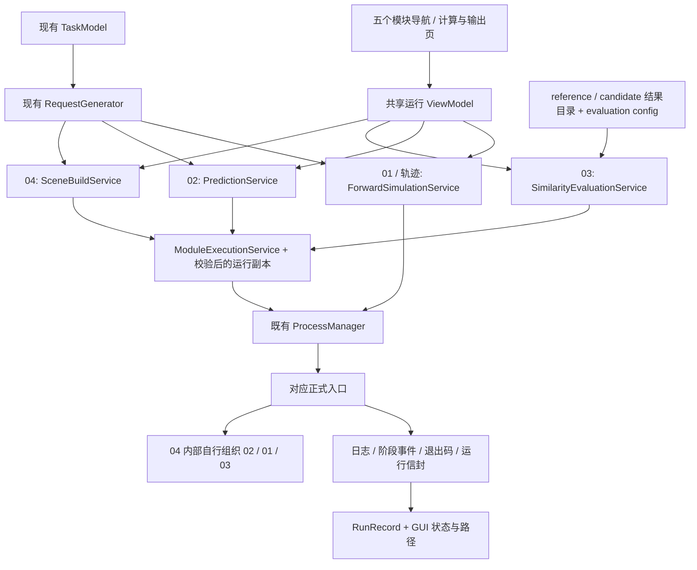

# P4.2 多模块程序调用扩展报告

日期：2026-09-12。范围：仅 `GUI_WPF/**`。

## 1. 交付结论与验收边界

已接通 02、03、04 业务服务、统一 RunRecord、五个模块导航及计算与输出页的运行/停止/状态。进程启动、stdout/stderr、GUI_PROGRESS、超时和 Job 进程树停止全部复用 P4.1 ProcessManager。VS2019 Release 重建成功，0 警告、0 错误。回归与新增测试合计 **268 项通过**。

必须区分以下能力与验证边界：

- 02 **temperature** 模式真实调用成功。point-image/both 参数已按真实入口接入，但未进行其模型依赖与推理实测。
- 03 真实入口要求**两份 01 正式 output 目录**。现行 02 原始预测目录不包含该合同所需的温度/红外历史文件，不能直接组成用户设想的“01 结果 + 02 结果”评价链。GUI 明确拒绝，不伪造数据、不转换物理结果、不修改后端合同。本次 03 成功测试采用明确标记的合成合同夹具，不能视为真实 01/02 科学计算的比较验证。
- 04 真实入口已测试不兼容请求报错，以及兼容请求进入 `checking_reference_cache` 后停止。**未运行完整场景搜索到成功终态**。Completed、不足量、缺失信封、错配 run_id、ProxyOnlyCompleted 等终态使用 C# 进程夹具验证，不能替代完整搜索实测。
- “轨迹生成”调用 01 产生轨迹；没有假设第五个独立计算入口，也没有接入轨迹结果后处理。
- 因上述接口和测试边界，不宣称“原始 02→03 联通”或“04 完整搜索实际成功”已经验收。

未推进结果 CSV 解析、曲线、图像、历史数据库或新的计算算法。

## 2. 阅读依据与真实入口

已阅读用户指定的 `.docs/00_project_brief.md`、01_architecture、02_workflow、04_decisions、05_known_issues、06_prompt_log、07_task_editor_v1_report，以及 P3_MODULE_IO_AUDIT_REPORT、P3_REQUEST_GENERATOR_REPORT、P4_1_PROCESS_MANAGER_REPORT。参数/目录依据冻结源码的 config.json、入口 parse_args/main、forward_request_schema.json、参考请求及评价配置核对。

| 模块 | config.json 正式入口 | 调用参数 | 工作目录 |
|---|---|---|---|
| 02 | `02-智能预测/02-程序/surrogate_prediction_runner.py` | `--params-json <request.json> --mode temperature/point-image/both` | 经校验的运行副本根目录 |
| 03 | `03-相似度评估/02-程序/similarity_evaluator.py` | `--mode similarity --reference-run <output> --candidate-run <output> --config <config.json>` | 同上 |
| 04 | `04-红外场景构建/02-程序/scene_search_controller.py` | `--request <scene-search-request.json> --config <scene_search_config.json>` | 同上 |

统一使用已解析的 Python 可执行文件与 `-B -u`，独立参数列表，不拼接 shell 命令；设置 UTF-8 和禁止 pycache 的环境变量。02 的 `--run-root`、03 的 `--output-dir` 并不能阻止其写入包内 latest_run.json，因此没有用这两个参数冒充完整隔离。04 没有 `--run-root` 或 `--prepare-only`。

02/03/04 使用实际解释器退出和 stderr 反映依赖错误；没有复用只检查 pandas 的 01 预检来宣称满足所有模块依赖。本机成功测试的 Python 为 `C:\Users\PC\anaconda3\python.exe`；生产代码不硬编码该路径，仍使用 BackendPathResolver/App.config。

04 源码已包含共享输入标准化、01 基准缓存/求解、02 温度代理筛选、候选 01 正向复核和 03 温度相似度评价。GUI 只启动该入口。`--proxy-only` 仍可能生成基准正向结果，不能当成 prepare-only，GUI 未提供该选项。

## 3. 修改文件列表

下列路径除特别说明外相对于 `GUI_WPF/PreProcess.Wpf/PreProcess.Wpf/`。

| 状态 | 文件 | 用途 |
|---|---|---|
| 新增 | `Services/Execution/PredictionService.cs` | 02 参数和共享请求生成 |
| 新增 | `Services/Execution/SimilarityEvaluationService.cs` | 03 结果引用与配置检查 |
| 新增 | `Services/Execution/SceneBuildService.cs` | 04 现有 v2 请求生成 |
| 新增 | `Services/Execution/ModuleExecutionService.cs` | 共用提交目录、日志落盘、调用、运行信封验证 |
| 新增 | `Services/Execution/RunRecord.cs` | 通用运行记录和当前应用内互斥运行租约 |
| 新增 | `Services/Execution/RuntimePackage.cs` | 后端运行部署副本及 SHA256 核对 |
| 新增 | `Services/Execution/ReferenceTaskLoader.cs` | 显式载入后端已有参考任务到现有 TaskModel |
| 修改 | `Services/Execution/ForwardSimulationService.cs` | ForwardRunRecord 继承 RunRecord，加入跨模块互斥；01 调用逻辑保留 |
| 修改 | `ViewModels/ForwardRunViewModel.cs` | 保留既有名称/API，扩展模块分派、配置、状态与关闭停止 |
| 修改 | `ViewModels/MainWindowViewModel.cs` | 五个导航连接共享执行实例 |
| 修改 | `ViewModels/TaskEditorViewModel.cs` | 共享执行引用与显式参考任务载入 |
| 新增 | `Views/ModuleExecutionPanel.xaml`、`.xaml.cs` | 统一运行控件 |
| 修改 | `Views/ForwardRunView.xaml` | 保留 P4.1 页面类型，承载共用控件 |
| 修改 | `Views/CalculationOutputView.xaml` | 嵌入运行控件，运行中锁定任务输入 |
| 修改 | `MainWindow.xaml.cs` | 计算页运行期间仍允许停止操作 |
| 修改 | `PreProcess.Wpf.csproj` | 编译新增服务和控件 |
| 新增 | `../MultiModuleTest/MultiModuleTest.csproj`、`Program.cs` | 新增真实入口与完成信封/取消测试 |

共 19 个源文件/项目文件：11 新增，8 修改。另新增本报告及 `GUI_WPF/Verification/P4_2/` 的测试脚本、差异与证据文件：

- `Test-MultiModuleUI.ps1`：新增 18 项界面测试。
- `Test-P2Regression.ps1`、`Test-P3Regression.ps1`、`Test-ExecutionUI.ps1`：沿用 P4.1 原测试，只切换本阶段构建目录，原文件保留。
- `before_hashes.csv`、`protected-hash-check.json`、`source-changes.csv`、`p4_2-source.diff`、`p4_2-source-numstat.txt`、`git-diff-stat.txt`。
- 各测试日志、request 样例、运行记录及测试输出目录；本目录 `.gitignore` 排除本地源码快照与大型部署/运行副本，证据仍在本机保留。

Services/Mappers、RequestGenerator、TaskModel、schema、原有 MapperTest/ProcessTest 测试源码均未修改或删除。`Services/Process/` 全部 **7/7 文件 SHA256 与本阶段开始一致**。

## 4. Service 设计与调用流程



ModuleExecutionService 仅共用业务执行记账，不实现进程创建、管道读取或进度解析。超时默认 6 小时，Stop/关闭均复用 ProcessManager 的 Job 清理。01 保留其原来的超时策略。

ReferenceTaskLoader 是用户显式选择的预设载入：从冻结 `surrogate_reference_request.json` 读入现有 TaskModel，验证统一物性，并逐项映射环境、观测、群运动、单目标运动和物性；不会在预测失败时自动替换任务。GUI 覆盖内存任务前提示确认，保留当前相似度验收阈值。测试验证完整请求字段 roundtrip 数值一致。没有第二套预测物理参数模型。

03 先检查目录、两份正式历史文件和评价配置是否存在；列、时间轴和数据合法性由后端权威提取器继续检查。GUI 不读取物理 CSV 内容。输入目录须指向 `output`，不是外层 run 根。

04 使用既有合同：

```json
{
  "schema_version": "scene-search-request-v2",
  "input_file": "本次共享 forward-request-v1 request.json 的绝对路径",
  "similarity_requirement": {
    "metric": "temperature_similarity",
    "target_object_id": 1,
    "required_percent": 90
  },
  "required_candidate_count": 10
}
```

required_percent 来自 `Task.Settings.SimilarityIndex`；候选数来自运行设置，必须为正整数。内部 config 和候选池使用未修改的后端原文件。

## 5. 运行目录与冻结保护

运行根继续使用 BackendPathResolver 的 RuntimeRoot，默认 `%LocalAppData%/PreProcess/Runtime`，不能位于冻结 coreprogram 内。测试显式指定 `GUI_WPF/Verification/P4_2/...`。

| 内容 | 目录规则 |
|---|---|
| 02/03/04 提交、stdout.log、stderr.log、run-location.json | `<RuntimeRoot>/requests/<02或03或04>/<GUID>/` |
| 02 输入 | 提交目录 `request.json`，完整六段 forward-request-v1 |
| 03 调用元数据 | 提交目录 `evaluation-reference.json`；只有结果引用和评价配置，不是新物理合同 |
| 04 输入 | 提交目录 `request.json` + `scene-search-request.json` |
| 后端部署副本 | `<RuntimeRoot>/backend/<源文件哈希清单SHA256>/package/` |
| 02 输出 | 副本 `02-智能预测/04-输出文件/runs/<run_id>/` |
| 03 输出 | 副本 `03-相似度评估/03-输出文件/runs/<run_id>/` |
| 04 输出 | 副本 `04-红外场景构建/03-输出文件/runs/<run_id>/` |
| 04 基准缓存 | 副本内后端自己管理的 reference_runs；GUI 不伪造缓存 |
| 01 输出 | 保留 P4.1 `<RuntimeRoot>/runs/<run_id>/output` 规则 |

第一次部署逐字节复制源文件；每次启动核对模型、脚本、可执行文件、配置等源文件哈希。三个原有 latest_run.json 是明确的运行时可变输出，后续不要求与初始指针内容相同。新增结果与缓存也是运行副本内的输出。发生非输出源文件校验失败时拒绝执行，提示使用新运行目录，不修补源码。

只采用与启动前内容不同的 latest_run 指针，要求目录存在、位于本模块 runs 内、目录名与 run_id 一致；避免错误地把上次成功结果附到本次失败记录。然后校对本次完成信封。当前互斥针对一个 GUI 进程；不提供多实例共享 RuntimeRoot 的并发协调，多实例并行应使用不同 RuntimeRoot。

## 6. 状态与 GUI

RunRecord 记录 Module、RunId、RequestPath、BackendRequestPath、RunDirectory、ResultDirectory、RuntimePackage、StartedAt、EndedAt、State、ExitCode、PrepareOnly、Message、Diagnostic、BackendStatus。没有建立历史数据库。

状态为 Preparing → Running → Completed/Failed/Cancelled；停止期间显示正在停止进程树。启动失败可能没有后端 run_id/output，仍保留提交记录和错误（如果错误发生在提交目录建立之前，则只有内存失败记录）。失败或取消后的目录仅供诊断，不当作成功结果。

02 使用带 module=02 的阶段事件；03 不发 GUI_PROGRESS，只显示启动/运行/终态和日志；04 自身事件没有 module，内部 01 事件可能带 module=01，原解析器可接受两种格式。不构造百分比。退出码 0 还需当前成功指针和正式完成信封；04 的 ProxyOnlyCompleted 不作为正式搜索完成。04 退出码 3 为不足量，标记 Failed 并保留目录和说明。

运行期间禁用模块选择与输入，运行按钮禁用，停止按钮启用；计算页仍允许停止。底部日志/告警/进度与模块页面使用同一执行实例。关闭窗口等待当前调用停止，避免留存子进程。本次仅读取状态/定位信封，不解析计算结果曲线或图像。

## 7. 测试结果

| 测试集 | 结果 | 证据（相对于 Verification/P4_2） |
|---|---:|---|
| 原 MapperTest | 5/5 | `mapper-results.txt` |
| P2 编辑页/布局/绑定回归 | 50/50 | `ui-results.txt` |
| P3 RequestGenerator/schema/覆盖回归 | 114/114 | `request-tests.log` |
| 原 P4.1 ProcessTest | 37/37 | `process-results.txt` |
| P4.1 界面/停止/关闭回归 | 14/14 | `execution-ui-tests.log` |
| 新 MultiModuleTest | 30/30 | `integration-results.txt` |
| 新多模块界面测试 | 18/18 | `multi-module-ui-results.txt` |
| 合计 | **268/268** | 所有断言通过 |

新增测试覆盖真实 02 温度调用、stdout、阶段进度、重复运行、默认任务不兼容、非法 mode、统一记录；真实 03 合同夹具调用、输出文件、无阶段事件、缺失目录/config、原始02拒绝、后端列检查失败；真实04请求拒绝与内部入口取消；C#夹具的正式成功/不足量/信封缺失/run_id错误/proxy-only拒绝/互斥/准备期停止。

实际 03 测试数据位于 `integration/SYNTHETIC_CONTRACT_FIXTURE/`，case_id 明确为 SYNTHETIC_TEST_ONLY，纯测试数据不能用于物理结论。GUI测试只建屏幕外测试窗口，未关闭用户已有应用。

运行记录可检查 `integration/real02.json`、`real03.json`、`real04-rejection.json`、`real04-cancelled.json`；其中包含实际请求和输出目录。`request.json` 和 `reference-roundtrip.json` 为测试请求样例。

测试中修复：参考请求比较使用数值等价而非 0/0.0 文本比较；运行副本允许后端更新其正式 latest_run 指针；计算页运行期间保留停止按钮；PowerShell 中文脚本使用 UTF-8 BOM。失败的初次测试不计入通过数量。

## 8. Release 构建与复现

编译器：VS2019 Professional MSBuild；目标 .NET Framework 4.8 / Any CPU / Release。

```powershell
& 'C:\Program Files (x86)\Microsoft Visual Studio\2019\Professional\MSBuild\Current\Bin\MSBuild.exe' GUI_WPF/PreProcess.Wpf/PreProcess.Wpf.sln /t:Rebuild /p:Configuration=Release '/p:Platform=Any CPU' /p:OutputPath=bin/P4_2Release/
```

结果：**0 警告，0 错误**，见 `Verification/P4_2/release-build.log`。使用独立输出目录，避免覆盖用户可能正在使用的旧 Release 文件。

交付程序：`GUI_WPF/PreProcess.Wpf/PreProcess.Wpf/bin/P4_2Release/PreProcess.Wpf.exe`。

MultiModuleTest 与原 ProcessTest 使用各自 csproj、同样的 Configuration/OutputPath 构建；从仓库根调用：

```powershell
& GUI_WPF/PreProcess.Wpf/MultiModuleTest/bin/P4_2Release/MultiModuleTest.exe GUI_WPF/Verification/P4_2/integration coreprogram <Python完整路径>
powershell -NoProfile -STA -ExecutionPolicy Bypass -File GUI_WPF/Verification/P4_2/Test-MultiModuleUI.ps1
```

## 9. Git diff 与保护检查

开始时工作区已有前阶段和用户修改，尤其 `.docs` 与 WPF 尚未提交文件。因此全仓 `git diff --stat`（存于 git-diff-stat.txt）**不是 P4.2 独有差异**，未提交、重置或覆盖这些改动。

P4.2 的源文件差异由开始时源码快照逐文件对比生成，见 `source-changes.csv`、`p4_2-source.diff`、`p4_2-source-numstat.txt`。19 文件，11 新增/8 修改；无 Mapper/测试删除。`git diff --check` 通过。

| 冻结/保护目录 | 开始文件数 | 结束文件数 | 内容变化 | 新增/删除 |
|---|---:|---:|---:|---:|
| coreprogram | 119 | 119 | 0 | 0 |
| GUI_MFC_Legacy | 1743 | 1743 | 0 | 0 |
| .docs | 9 | 9 | 0 | 0 |

逐文件 SHA256 基线在 `before_hashes.csv`，汇总在 `protected-hash-check.json`。没有修改冻结入口、Python/Fortran、forward-request-v1 或 Legacy；运行副本中脚本、模型和配置保持源文件内容，只有后端合法输出变化。

## 10. 下一阶段建议（本次未实施）

1. 先由后端负责人明确 02 预测输出是否应具备可直接送入03的正式合同；保持现有GUI明确拒绝，不能自行补物理字段。
2. 单独安排完整04实际搜索验收，以及 point-image/both 所需模型环境验收；核查成功结果和运行成本后再扩大应用范围。
3. 之后再按真实输出合同设计结果浏览；本阶段到调用/状态/目录为止，不实施结果解析或展示。

本阶段工作结束。
